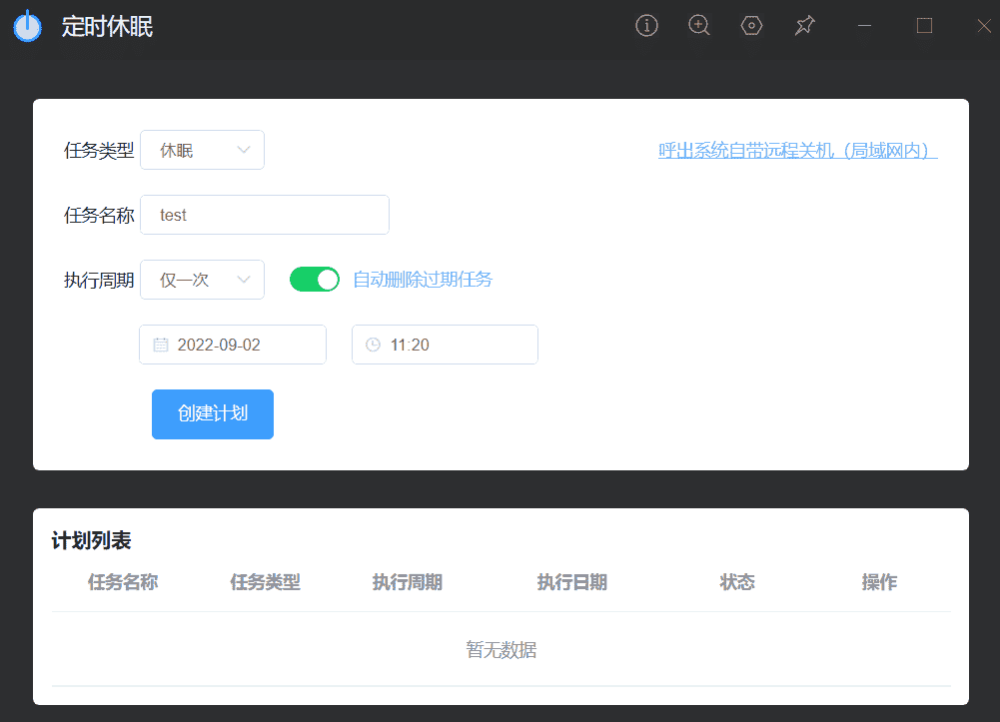
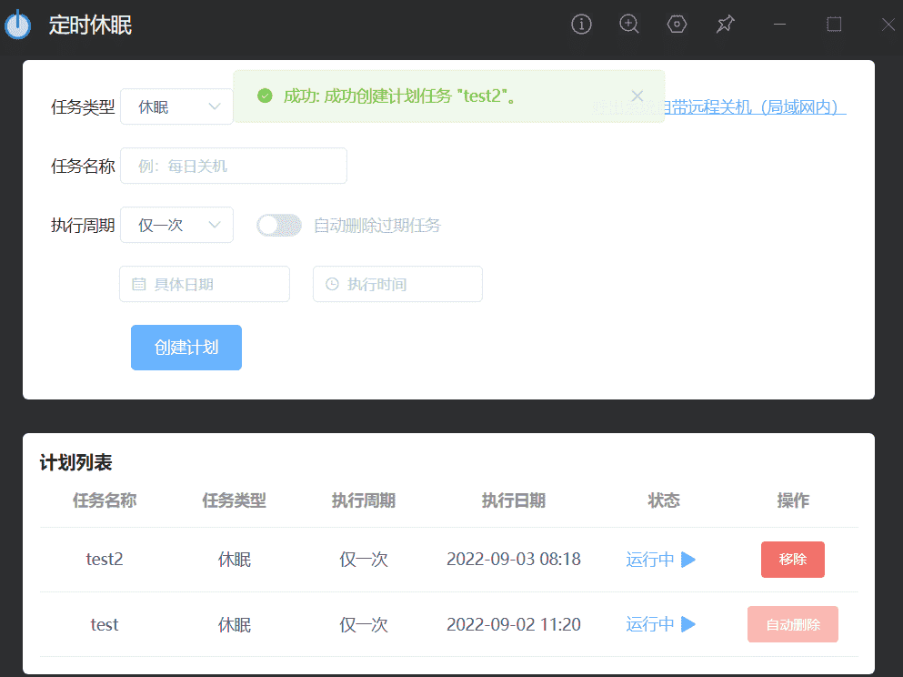

# timed-shutdown

### 简介

设置完任务类型、名字、执行时间后点击创建任务，就可以添加到计划列表（插件的实现也是依托于 window 系统的任务计划程序），已创建的任务可以在插件的计划列表移除。

### 截图





### 关键词

输入框内输入“定时关机”、“定时重启”、"定时休眠"等关键词

通过关键词进入插件能快速选择对应任务类型

### 注意

- 该插件仅支持 window 系统

- win11 可能出现休眠时间过长后会变成关机（命令执行确实是休眠），其他 window 系统未测试

- 创建时要确保系统的任务计划程序没有与要添加的任务同名，否则点击创建会无反应

### 使用

```
yarn install
yarn serve

//用utools开发者工具打包dist目录
yarn build
```

### 安装

[GitHub Release](https://github.com/tk914/timed-shutdown/releases)