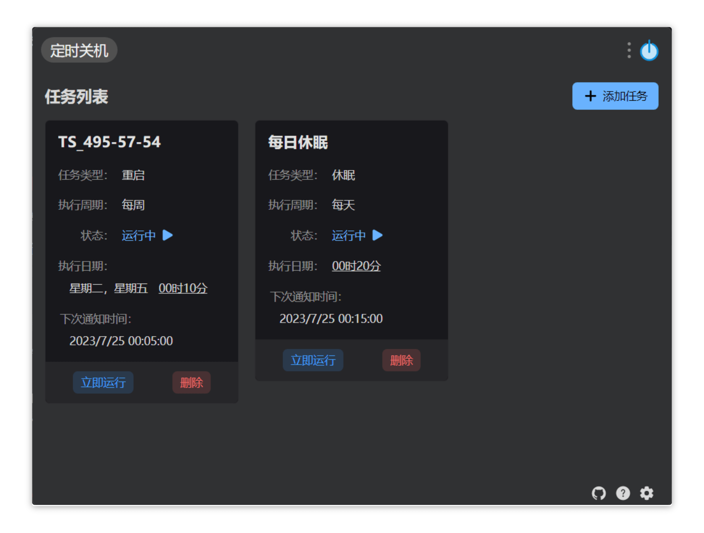

# 定时关机、重启、休眠

### 使用

**首次安装需要设置“跟随主程序同时启动”**

设置完任务类型、名字、执行时间后点击创建任务添加到计划列表（插件的实现是依托于 windows 系统的任务计划程序），已创建的任务可以在插件的计划列表移除。

**使用前请先阅读[注意](#notic)**

### 关键词

输入框内输入“定时关机”、“定时重启”、"定时休眠"等关键词

### 注意

- win11 可能出现休眠时间过长后会变成关机（命令执行确实是休眠），其他 windows 系统未测试
- 创建时要确保系统的任务计划程序没有与要添加的任务同名，否则点击创建会无反应
- 该插件仅支持 windows 系统

### 安装

插件市场搜索或者[GitHub Release](https://github.com/xyeluo/timed-shutdown/releases)
